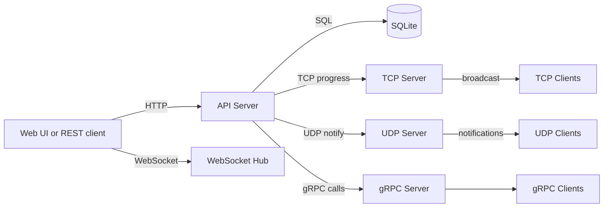

# MangaHub Architecture Overview

## System Summary
MangaHub is a Go backend that exposes an HTTP REST API and several real-time protocols. The API server owns the main business logic and database access, while the TCP, UDP, WebSocket, and gRPC services provide specialized communication channels.

## Core Components
- API Server (Gin): REST endpoints, auth, HTML demo, and WebSocket upgrade.
- SQLite: primary data store (manga, users, library, progress).
- TCP Server: progress sync and broadcast for connected clients.
- UDP Server: notification broadcast with ACK retries.
- WebSocket Hub: real-time chat rooms per manga.
- gRPC Server: internal service endpoints for manga and user data.

## Data Flows
- Auth and catalog: Client -> HTTP API -> SQLite -> Response
- Progress update: Client -> HTTP API -> SQLite -> TCP broadcast
- Notifications: Client -> HTTP API -> UDP broadcast -> Client ACK
- WebSocket chat: Client <-> API WebSocket Hub
- Internal services: gRPC Client -> gRPC Server -> SQLite

## Ports

| Service | Protocol | Default Port |
| --- | --- | --- |
| API Server | HTTP, WebSocket | 8080 |
| TCP Server | TCP | 9000 |
| UDP Server | UDP | 9001 |
| gRPC Server | gRPC | 50051 |

## Diagram

